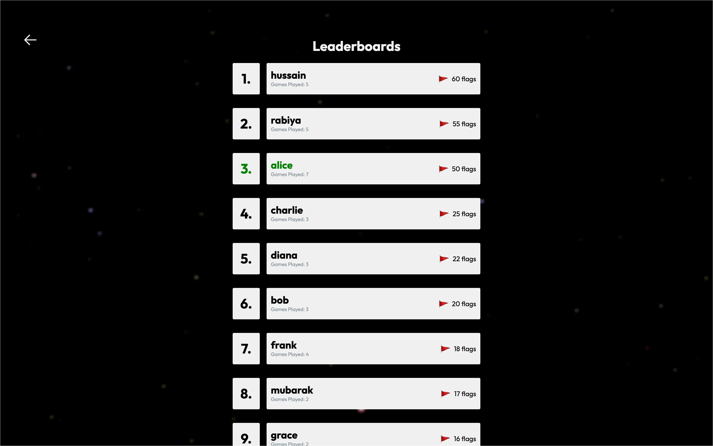
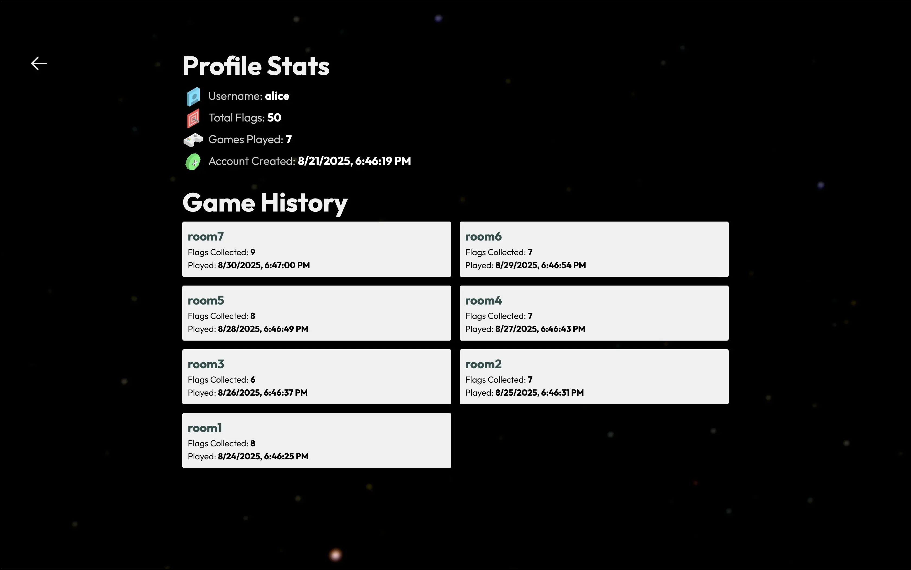

# 🚩 Pathless Trails

A fast-paced multiplayer maze where players pick a username, dive in, and race to collect as many flags as possible.
Simple to pick up, but full of competition — run, collect, and win!

This project was built using **Node.js, Socket.io, and PostgreSQL**, with Docker and AWS for hosting.
It offers real-time multiplayer rooms, player profiles, leaderboards, and smooth maze gameplay.

## 🕹️ Features

-   Jump into real-time multiplayer rooms and play with others instantly.
-   Pick a unique username — no passwords, no hassle.
-   Create your own game or join someone else’s in the lobby.
-   Navigate a maze with collisions, collect flags, and race against the timer.
-   Track your progress with a personal profile: games played, flags collected, and join date.
-   See where you stand among all players on the global leaderboard.

## 👾 Demo

Live Demo: [_click me!_](https://pathless.hussainkazarani.site/)

<div align="center">
<!-- Top: Gameplay GIF -->

https://github.com/user-attachments/assets/331871e2-7870-4eaa-9ebe-c7bba4bb8aca

<!-- <figcaption><em>gameplay loop</em></figcaption> -->

 <p>&nbsp;</p>

<!-- Second: Screenshot -->
<figure>
  
  <figcaption><em>leaderboards page</em></figcaption>
</figure>

  <p>&nbsp;</p>

<!-- Third: Screenshot -->
<figure style="border: 1px solid white;">

  <figcaption><em>profile page</em></figcaption>
</figure>

  <p>&nbsp;</p>

</div>

## ⚙️ Local Installation

### Prerequisites

-   **Docker** (latest version recommended) — [Download Docker](https://www.docker.com/get-started)
-   **Docker Compose** (usually included with Docker Desktop)

### Installation

1. **Clone the Repository**

-   Using Git:

    ```bash
    git clone https://github.com/hussainkazarani/pathless-trails.git
    cd pathless-trails
    ```

-   Or download the ZIP and extract it.

2. **Configure Environment Variables**

-   The repository already includes a `.env` file with dummy values.
-   Open the `.env` file at the root and update the database and server credentials as needed:

    ```env
    # App
    PORT=1000

    # Database
    POSTGRES_USER=hussainkazarani
    POSTGRES_PASSWORD=kazarani
    POSTGRES_DB=pathless_trails
    POSTGRES_HOST=custom-postgres
    POSTGRES_PORT=5432
    ```

> **Note:** `POSTGRES_HOST` should remain "custom-postgres" — this is the service name defined in `docker-compose.yml` and ensures Node.js connects to the PostgreSQL container. Do **NOT** use "localhost" inside Docker.

## Running the Application

### Starting Locally

-   Navigate to the `deploy` folder:

    ```bash
    cd deploy
    ```

-   Run Docker Compose using the included `.env` file:

    ```bash
    docker compose --env-file ../.env up
    ```

-   This will start both the **Node.js server** and **PostgreSQL database** locally.

### Stopping the Application

-   To stop the running containers:

    ```bash
    docker compose down
    ```

### Accessing the Game

-   Open your browser and go to:

    ```
    http://localhost:1000
    ```

-   Replace `1000` with the port specified in your `.env` file if it was changed.
